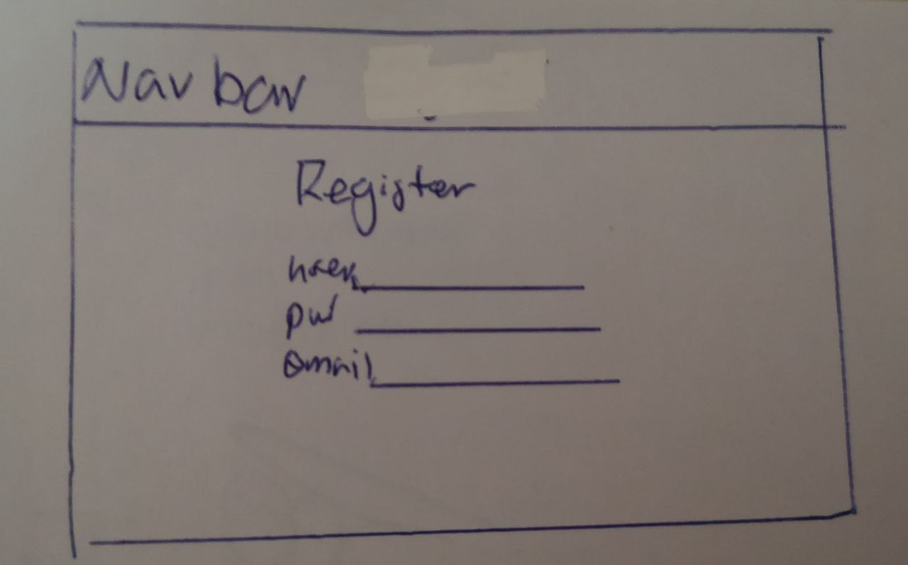
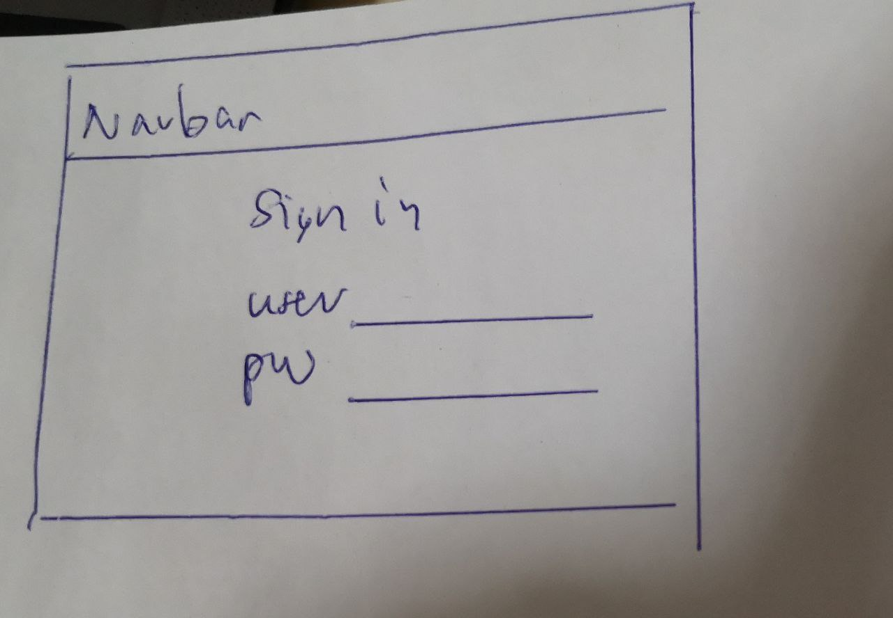
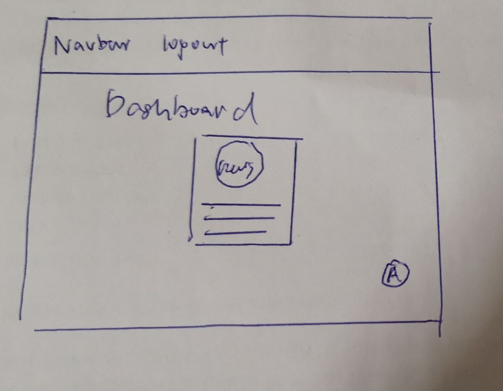
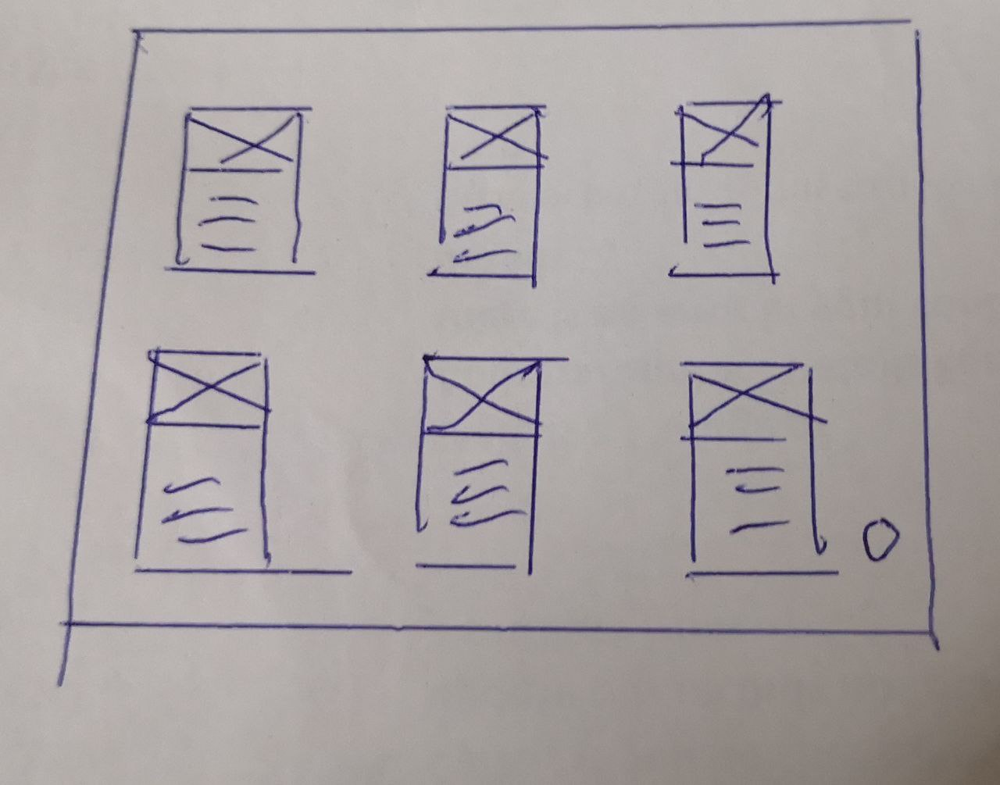

# Personal Voice Assistant Web Application

### Overview
This a personalised web application created using Django and React where user can interact with the mini app using AI voice bot. In this case, a news mini app is created on dashboard for user to search news and read news headlines with the help of voice command. User can also go hands free when the ai voice read the headlines of news article, and scroll along the page highlighting the article that is being read. Integration of music application and AIGC chatbots are also are possible in this application.

### Teachnologies used
- Django (Include built in security features for hashing for registration, secured login, sessions etc)
- React
- PostgreSQL (Originally using mySQL. As hosting platform, Render provides better integration of free PostgreSQL, mySQL has been replaced)
- Alan AI (For speech recognition) SDK (Got 12k + free interactions)
- News API (100 requests per day)
- MUI, Bootstrap, Gestalt (For UI)

### User story
- Register an account using user name, pw, email data stored on Postgresql database
- Login securely and able to stay logged in with sessions created
- Logout
- Command Alan ai to search news by source, topic and recency
- Have Alan ai read news headlines
- Have screen auto scroll along with reading of article headline

### Challenges
- First attempt of using Django with steep learning curve from picking up from scratch
- Alan AI SDK voice command scripting
- Integration of Static files from React on Djang
- Super nested folders for Django project, Django Application, React App, Build Static, Collected Staticfiles
- Incompatiable Django and dependencies version on Render platform
- Less compatiable choise of Database on Render hosting platform
- Failed attempt to deploy on Vercel (better at serving static files)

### Future improvements
- Can store some data like favourite items on database in future (Free Postgresql on has 1gb from render)
- Integreate more mini apps
- Make ai bot more talkative and interactive

### Demo video
To be updated

### Live site
https://personal-voice-assistant-thui.onrender.com/

### Wireframe 

